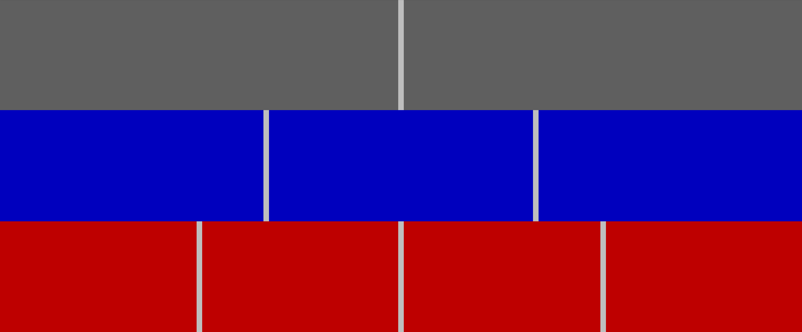
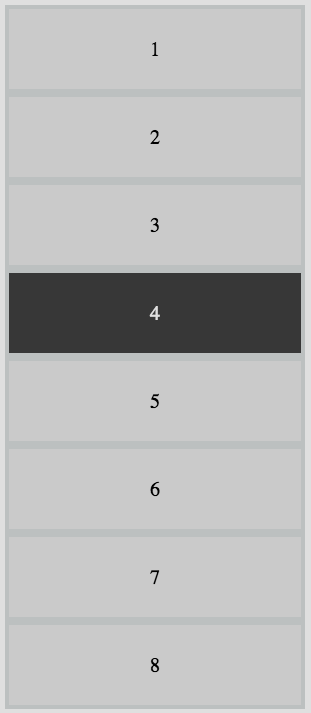
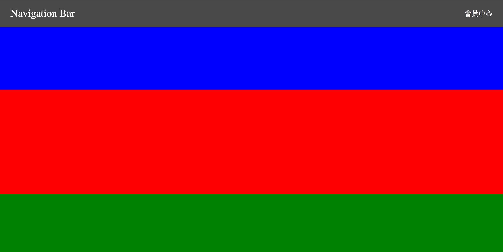
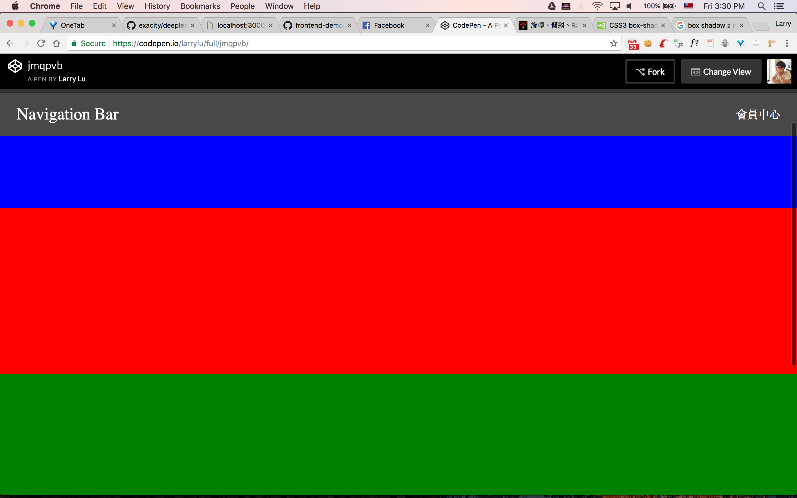
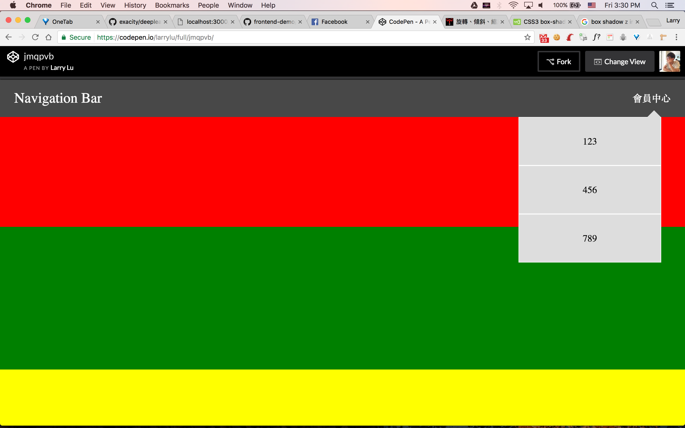

# CSS Layout

### [Codepen 000](https://codepen.io/larrylu/pen/BRNxdY?editors=0010)

---

### [Codepen 001-Andy](https://codepen.io/Andy-Chen/pen/ybeLxX?editors=1100)
### [Codepen 001-Larry](https://codepen.io/larrylu/pen/XRXWbR?editors=1100)

- [CSS text-align Property](https://www.w3schools.com/cssref/pr_text_text-align.asp)
- [CSS 垂直置中的三個方法](http://www.oxxostudio.tw/articles/201408/css-vertical-align.html)
- [CSS 垂直置中的七個方法](http://www.oxxostudio.tw/articles/201502/css-vertical-align-7methods.html)
- [用 css 讓區塊水平垂直置中](http://muki.tw/tech/css-div-center/)

---

### [Codepen 002-Andy](https://codepen.io/Andy-Chen/pen/rmxeJO?editors=1100)
### [Codepen 002-Larry](https://codepen.io/larrylu/pen/zwrvba?editors=1100)

- [深入解析 CSS Flexbox](http://www.oxxostudio.tw/articles/201501/css-flexbox.html)
- [CSS3 border-radius Property](https://www.w3schools.com/cssref/css3_pr_border-radius.asp)
- [CSS - 百分比寬度](http://zh-tw.learnlayout.com/percent.html)

---

### [Codepen 003-Andy](https://codepen.io/Andy-Chen/pen/PmZLVo)
### [Codepen 003-Larry](https://codepen.io/larrylu/pen/YVwrGV)

- [选择器(Selectors)](https://developer.mozilla.org/zh-CN/docs/Web/Guide/CSS/Getting_started/Selectors)
- [CSS中的多重選擇器](https://pjchender.blogspot.tw/2015/03/cssmultiple-selectorsspace.html)
- [深入解析 CSS Flexbox](http://www.oxxostudio.tw/articles/201501/css-flexbox.html)
 
> 每個 div 的高度都是 200px  
> 顏色分別是 gray, blue, red

---

### [Codepen 004-Andy](https://codepen.io/Andy-Chen/pen/NjNKeo)
### [Codepen 004-Larry](https://codepen.io/larrylu/pen/dWGBqg)

- [CSS overflow 屬性用法讓你掌握控制捲軸效果](http://www.webtech.tw/info.php?tid=28)
- [CSS 背景屬性](http://www.1keydata.com/css-tutorial/tw/background.php)
- [CSS 3背景新屬性：background-size](http://www.kip.com.tw/modules/news/article.php?storyid=35)
 
> 把整個頁面分成三個 column  
> 只有中間那個 column 可以用滑鼠上下滾動  
> 圖片網址 [https://fakeimg.pl/400x300/](https://fakeimg.pl/400x300/)

---

### [Codepen 005-Andy](https://codepen.io/Andy-Chen/pen/bWpKZm)
### [Codepen 005-Larry](https://codepen.io/larrylu/pen/EmKRRj)

- [CSS 邊框](http://www.1keydata.com/css-tutorial/tw/border.php)
- [教學 | CSS 網頁互動的好幫手 - hover的應用](http://weilife.pixnet.net/blog/post/321563384-%E6%95%99%E5%AD%B8-%7C-css-%E7%B6%B2%E9%A0%81%E4%BA%92%E5%8B%95%E7%9A%84%E5%A5%BD%E5%B9%AB%E6%89%8B---hover%E7%9A%84%E6%87%89%E7%94%A8)

> 全部共有 8 個 item  
> 每個 item 都有邊框  
> 滑鼠移到 item 上面時背景變黑  

---

### [Codepen 006-Andy](#)
### [Codepen 006-Larry](#)

- [旋轉、傾斜、縮放的變形效果 transform](http://boohover.pixnet.net/blog/post/35341387-%E6%97%8B%E8%BD%89%E3%80%81%E5%82%BE%E6%96%9C%E3%80%81%E7%B8%AE%E6%94%BE%E7%9A%84%E8%AE%8A%E5%BD%A2%E6%95%88%E6%9E%9C-transform-%28css-prope)
- [關於 position 屬性](http://zh-tw.learnlayout.com/position.html)

> 頁面滑動時上方的 NavBar 要一直固定在上面  
> 滑鼠移到會員中心時會跳出選單  
> 頁面內容隨便放一些色塊就可以了  

