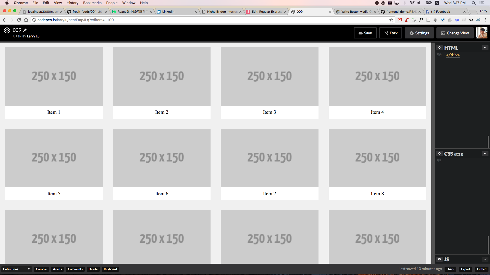
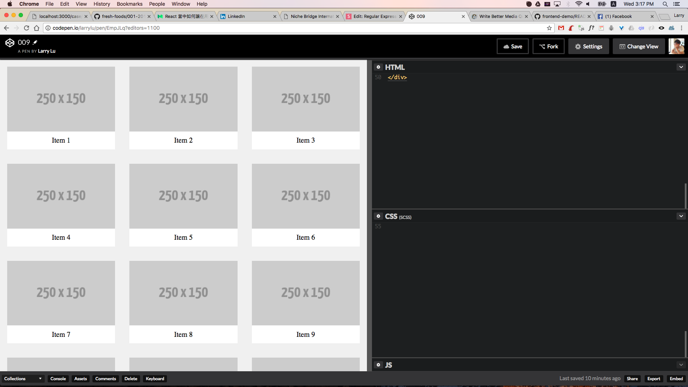
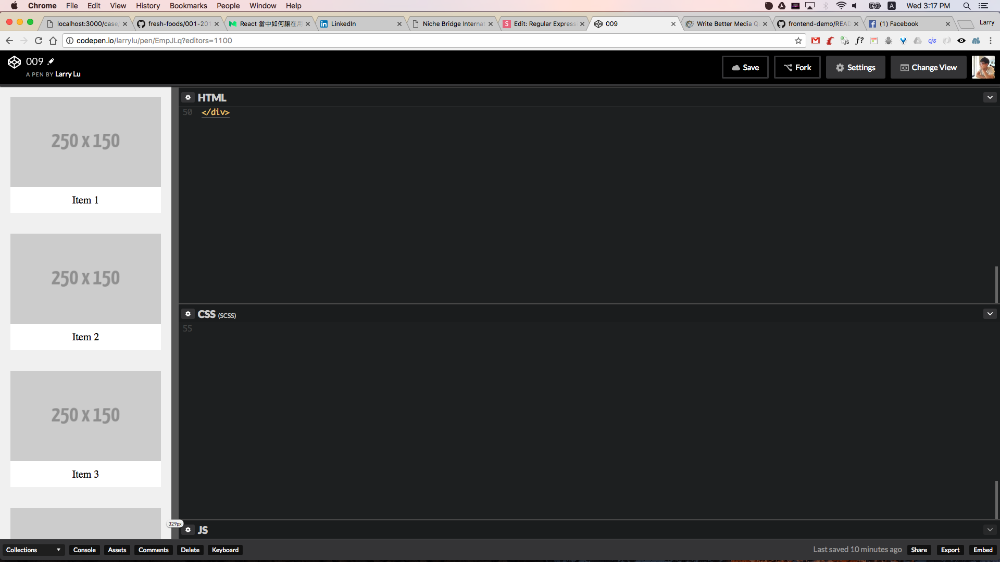

# CSS Layout

### [Codepen 000](https://codepen.io/larrylu/pen/BRNxdY?editors=0010)


---

### [Codepen 001-Andy](https://codepen.io/Andy-Chen/pen/ybeLxX?editors=1100)
### [Codepen 001-Larry](https://codepen.io/larrylu/pen/XRXWbR?editors=1100)

- [CSS text-align Property](https://www.w3schools.com/cssref/pr_text_text-align.asp)
- [CSS 垂直置中的三個方法](http://www.oxxostudio.tw/articles/201408/css-vertical-align.html)
- [CSS 垂直置中的七個方法](http://www.oxxostudio.tw/articles/201502/css-vertical-align-7methods.html)
- [用 css 讓區塊水平垂直置中](http://muki.tw/tech/css-div-center/)


---

### [Codepen 002-Andy](https://codepen.io/Andy-Chen/pen/rmxeJO?editors=1100)
### [Codepen 002-Larry](https://codepen.io/larrylu/pen/zwrvba?editors=1100)

- [深入解析 CSS Flexbox](http://www.oxxostudio.tw/articles/201501/css-flexbox.html)
- [CSS3 border-radius Property](https://www.w3schools.com/cssref/css3_pr_border-radius.asp)
- [CSS - 百分比寬度](http://zh-tw.learnlayout.com/percent.html)


---

### [Codepen 003-Andy](https://codepen.io/Andy-Chen/pen/PmZLVo)
### [Codepen 003-Larry](https://codepen.io/larrylu/pen/YVwrGV)

- [选择器(Selectors)](https://developer.mozilla.org/zh-CN/docs/Web/Guide/CSS/Getting_started/Selectors)
- [CSS中的多重選擇器](https://pjchender.blogspot.tw/2015/03/cssmultiple-selectorsspace.html)
- [深入解析 CSS Flexbox](http://www.oxxostudio.tw/articles/201501/css-flexbox.html)
 
> 每個 div 的高度都是 200px <br />
> 顏色分別是 gray, blue, red


---

### [Codepen 004-Andy](https://codepen.io/Andy-Chen/pen/NjNKeo)
### [Codepen 004-Larry](https://codepen.io/larrylu/pen/dWGBqg)

- [CSS overflow 屬性用法讓你掌握控制捲軸效果](http://www.webtech.tw/info.php?tid=28)
- [CSS 背景屬性](http://www.1keydata.com/css-tutorial/tw/background.php)
- [CSS 3背景新屬性：background-size](http://www.kip.com.tw/modules/news/article.php?storyid=35)
 
> 把整個頁面分成三個 column <br />
> 只有中間那個 column 可以用滑鼠上下滾動 <br />
> 圖片網址 [https://fakeimg.pl/400x300/](https://fakeimg.pl/400x300/)


---

### [Codepen 005-Andy](https://codepen.io/Andy-Chen/pen/bWpKZm)
### [Codepen 005-Larry](https://codepen.io/larrylu/pen/EmKRRj)

- [CSS 邊框](http://www.1keydata.com/css-tutorial/tw/border.php)
- [教學 | CSS 網頁互動的好幫手 - hover的應用](http://weilife.pixnet.net/blog/post/321563384-%E6%95%99%E5%AD%B8-%7C-css-%E7%B6%B2%E9%A0%81%E4%BA%92%E5%8B%95%E7%9A%84%E5%A5%BD%E5%B9%AB%E6%89%8B---hover%E7%9A%84%E6%87%89%E7%94%A8)

> 全部共有 8 個 item <br />
> 每個 item 都有邊框 <br />
> 滑鼠移到 item 上面時背景變黑 <br />


---

### [Codepen 006-Andy](https://codepen.io/Andy-Chen/pen/KmzxJQ)
### [Codepen 006-Larry](https://codepen.io/larrylu/pen/jmqpvb)

- [旋轉、傾斜、縮放的變形效果 transform](http://boohover.pixnet.net/blog/post/35341387-%E6%97%8B%E8%BD%89%E3%80%81%E5%82%BE%E6%96%9C%E3%80%81%E7%B8%AE%E6%94%BE%E7%9A%84%E8%AE%8A%E5%BD%A2%E6%95%88%E6%9E%9C-transform-%28css-prope)
- [關於 position 屬性](http://zh-tw.learnlayout.com/position.html)
- [CSS z-index 語法範例](http://www.wibibi.com/info.php?tid=155)

> 頁面滑動時上方的 NavBar 要一直固定在上面 <br />
> 滑鼠移到會員中心時會跳出選單 <br />
> 頁面內容隨便放一些色塊就可以了 <br />


---

### [Codepen 007-Andy](https://codepen.io/Andy-Chen/pen/ZKxZxb)
### [Codepen 007-Larry](https://codepen.io/larrylu/pen/mmxyMG?editors=1100)

- [CSS3 @media Rule](https://www.w3schools.com/cssref/css3_pr_mediaquery.asp)
- [CSS Media Queries 介紹與基礎應用](http://muki.tw/tech/css-media-queries-introduce-basic/)
- [Media Query 小撇步](https://blog.hinablue.me/css-media-query-tips/)
- [CSS content Property](https://www.w3schools.com/cssref/pr_gen_content.asp)

> 寬度大於 700 時顯示藍色的 ">700" <br />
> 寬度小於 700 時顯示紅色的 "\<700"


---

### [Codepen 008-Andy](https://codepen.io/Andy-Chen/pen/ZKjGwL)
### [Codepen 008-Larry](https://codepen.io/larrylu/pen/WjyMZN)

> 一個 container 裡面有六個 item <br />
> 每個 item 都有框線且裡面的字都垂直置中 <br />
> 當螢幕寬度大於 800 時，一個 row 放 3 個 item <br />
> 當螢幕寬度介於 500 ~ 800 時，一個 row 放 2 個 item <br />
> 當螢幕寬度小於 500 時，一個 row 放 1 個 item


---

### [Codepen 009-Andy](https://codepen.io/Andy-Chen/pen/vmaqxP)
### [Codepen 009-Larry](https://codepen.io/larrylu/pen/EmpJLq)

> 一個 container 裡面有 12 個 item <br />
> 每個 item 都包含一張圖片和item標題 <br>
> 圖片網誌[https://fakeimg.pl/250x150/](https://fakeimg.pl/250x150/) <br />
> 圖片縮放的時候不可以只有變寬，要整張圖變大 <br />
> 每個 item 之間要有一些距離不能黏在一起 <br />
> <br />
> 螢幕分成四種 size <br />
> 1200 以上是 large，一個 row 放 4 個 item <br />
> 800 ~ 1200 是 big，一個 row 放 3 個 item <br />
> 400 ~ 800 是 medium，一個 row 放 2 個 item <br />
> 400 以下是 small，一個 row 放 1 個 item <br />






---

### [Codepen 010-Andy](https://codepen.io/Andy-Chen/pen/NgGwyM)
### [Codepen 010-Larry](https://codepen.io/larrylu/pen/jwOdrZ?editors=1100)

- [可縮放向量圖形 - 維基百科，自由的百科全書](https://zh.wikipedia.org/wiki/%E5%8F%AF%E7%B8%AE%E6%94%BE%E5%90%91%E9%87%8F%E5%9C%96%E5%BD%A2)
- [fill | CSS-Tricks](https://css-tricks.com/almanac/properties/f/fill/)
- [SVG 研究之路 (4) - Path 基礎篇 - OXXO.STUDIO](http://www.oxxostudio.tw/articles/201406/svg-04-path-1.html)

> 做一個跟 Github 一樣的 Component，總共有 5 個 row <br>
> 第 1 個 row 顯示最後一次 commit 的內容，第 2 ~ 5 個 row 顯示 repo 內的檔案及資料夾<br>
> 注意第 1 個 row 左上右上要有 3px 的圓角，最後一個 row 左下右下也要有 3px 的圓角<br>
> 每個 row 之間只會有 1px 的框線(善用 .row + .row)
> <br>
> 資料夾跟文件的圖可以用 html 的 svg 畫出來<br>
> 程式碼如下
```html
<!-- 資料夾 -->
<svg height="16" width="14">
      <path d="M13 4H7V3c0-.66-.31-1-1-1H1c-.55 0-1 .45-1 1v10c0 .55.45 1 1 1h12c.55 0 1-.45 1-1V5c0-.55-.45-1-1-1zM6 4H1V3h5v1z"></path>
</svg>

<!-- 檔案 -->
<svg height="16" width="14">
  <path d="M6 5H2V4h4v1zM2 8h7V7H2v1zm0 2h7V9H2v1zm0 2h7v-1H2v1zm10-7.5V14c0 .55-.45 1-1 1H1c-.55 0-1-.45-1-1V2c0-.55.45-1 1-1h7.5L12 4.5zM11 5L8 2H1v12h10V5z"></path>
</svg>
```

可能會用到的色碼 | 色碼值
------------ | -------------
淺色文字 | #586069
第一個 row 的背景 | #f1f8ff
第一個 row 的框線 | #c8e1ff
其他 row 的背景 | white
其他 row 的框線 | rgb(223, 226, 229)
svg 文件夾 的顏色 | rgba(3, 47, 98, 0.5)
svg 檔案 的顏色 | rgb(36, 41, 46)
檔案名的藍字 | rgb(3, 102, 214)


