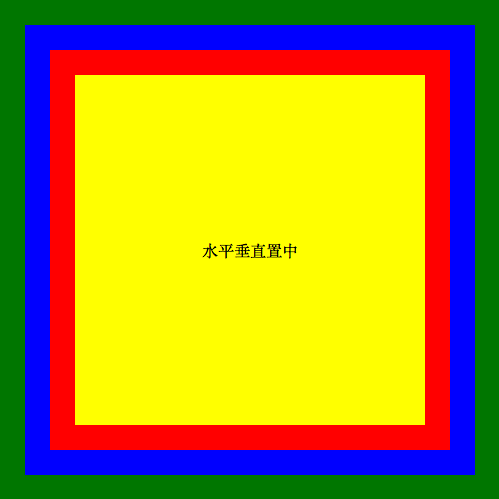

# CSS Layout

### [Codepen 000](https://codepen.io/larrylu/pen/BRNxdY?editors=0010)

---

### [Codepen 001-Andy](https://codepen.io/Andy-Chen/pen/ybeLxX?editors=1100)
### [Codepen 001-Larry](https://codepen.io/larrylu/pen/XRXWbR?editors=1100)

- [CSS text-align Property](https://www.w3schools.com/cssref/pr_text_text-align.asp)
- [CSS 垂直置中的三個方法](http://www.oxxostudio.tw/articles/201408/css-vertical-align.html)
- [CSS 垂直置中的七個方法](http://www.oxxostudio.tw/articles/201502/css-vertical-align-7methods.html)
- [用 css 讓區塊水平垂直置中](http://muki.tw/tech/css-div-center/)

---

### [Codepen 002-Andy](#)
### [Codepen 002-Larry](#)

- [深入解析 CSS Flexbox](http://www.oxxostudio.tw/articles/201501/css-flexbox.html)
- [CSS3 border-radius Property](https://www.w3schools.com/cssref/css3_pr_border-radius.asp)
- [CSS - 百分比寬度](http://zh-tw.learnlayout.com/percent.html)

---
